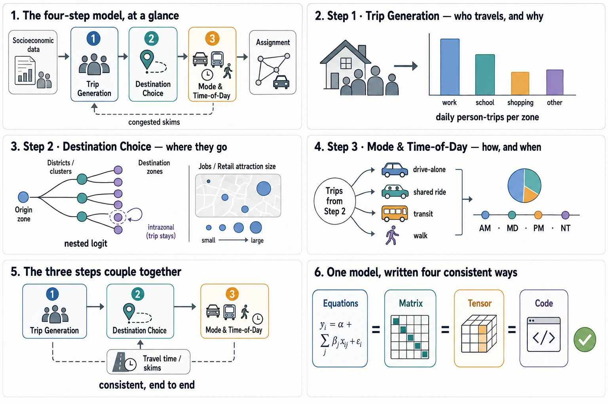
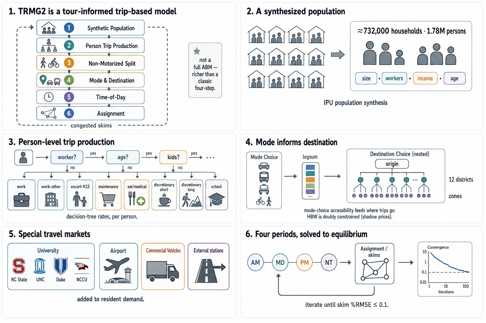

# GMNS Transfer of TRMG2 — Open 4-Step + Tensor Flow-Through Companion

> ASU companion branch of the official
> [TRMG2](https://github.com/Triangle-Modeling-and-Analytics/TRMG2)
> (© 2022 ITRE, MIT License). Not part of the official model — see
> [ATTRIBUTION.md](ATTRIBUTION.md). All coefficients are TRMG2's own.
>
> **Pre-assignment tensors** (`matrices/`) and **pre-built ONNX artifacts**
> (`tcg/artifacts/`) are distributed as a **GitHub Release** asset
> (`TRMG2_GMNS_tensors.zip`), not committed to git. Download the release and unzip
> it into this folder, or rebuild the snapshot from scratch with
> `python make_od_4period.py && python matrix_ops.py AM`. Everything else — code,
> config, network, docs — is in the repository.

## The model, at a glance

**What a four-step demand model is** — the first three behavioral steps and how
they stay consistent end to end:



**How TRMG2 is actually built** — a tour-informed, trip-based regional model:
population synthesis, person-level decision-tree production, mode-informs-destination
nesting, special markets, and equilibrium feedback. This is what the open transfer
reproduces.



### Explore it (learning pages)

Interactive, self-contained HTML — open locally, or enable GitHub Pages to view in
the browser. Each is a focused module, not an everything-page:

- **[observatory.html](observatory.html)** — *Model Inventory* (Tab 1): what the model
  is, who governs it, the 21 modules with how-much-you-can-run status, per-step compute
  cost, and doc reading times.
- **[observatory_generation.html](observatory_generation.html)** — *Trip Generation*
  (Tab 4): the 8 home-based purposes + the actual home-based-work decision tree.
- **[observatory_destination.html](observatory_destination.html)** — *Destination
  Choice* (Tab 5): the nested logit over 12 districts + a real AM district OD heatmap.
- **[observatory_validation.html](observatory_validation.html)** — *OD Validation*
  (Tab 9): how to verify a demand OD against counts — **magnitude bias first, then
  pattern** — with TRMG2's published targets. Method: `od_validation.py` +
  [doc/OD_VALIDATION_FRAMEWORK.md](doc/OD_VALIDATION_FRAMEWORK.md).
- **[dashboard.html](dashboard.html)** — the four-step model + tensor flow-through
  at a glance.

4 of the 9 observatory tabs are built; the rest are on the roadmap.

### Built on GMNS

The network here is expressed in **GMNS — the General Modeling Network
Specification**, an open, human-readable standard for transportation networks
stewarded by the Zephyr Foundation. Using GMNS is what makes this model portable
and inspectable: nodes, links, and movements are plain CSVs any tool can read.

- **GMNS specification** — https://zephyr-data-specs.github.io/GMNS/
- **Zephyr · Network Standard & Tools** — https://zephyrtransport.org/projects/2-network-standard-and-tools/

---

An open reproduction of the **Triangle Regional Model (TRMG2)**
full four-step demand model and traffic assignment, expressed as a **differentiable
tensor (Flow-Through-Tensor) computational graph** and driven by a compact
**coefficient config**. Three layers:

1. **Reproduction** — GMNS network + 4-step demand (generation → nested-logit
   destination choice → mode/TOD) + TAPLite assignment, faithful to the GISDK
   source. All inputs are CSV (`se_data/`, `params/`); no source-model binary.
2. **Tensor foundation** — the first three steps + assignment as coupled tensor
   operators with explicit coupling constraints, verified rung-by-rung
   (regular → matrix → tensor → code) in `tensor_ftt/consistency_ladder.py`.
3. **Small-form model** — reproduce the system from just a **coefficient config**
   (`config/`) + the **pre-assignment tensors** (`matrices/`): no master CSVs, no
   kernel re-run (`tensor_ftt/small_model.py`, `ftt_pipeline.py`).

The formal tensor-math write-up is an unpublished manuscript and is not included
in this repository; it will be released with the associated publication.

## Folder map (for MPO reviewers)
| path | what |
|---|---|
| `make_od_4period.py` | **the pipeline** — 4-step demand (gen→nested DC→mode/TOD) + TAPLite assignment, 4 periods |
| `config/` + `config_extract.py` | **coefficient config** (`model_coefficients.json`) — all TRMG2 DC/mode/TOD coefficients in one file |
| `se_data/` | socioeconomic tables as CSV (`se_2020..2055`) + `se_loader.py` |
| `params/` | shadow prices + init congested times as CSV (converted from .bin) |
| `scenario/`, `scenario_{AM,MD,PM,NT}/` | GMNS network + per-period demand the kernel reads |
| `matrices/` | extracted `B_OD,P` (Δ), `A_P,L`, `Π` sparse operators |
| `tensor_ftt/` | **the whole 4-step as ONE Flow-Through-Tensor graph** (everything supplied as tensors, differentiable) |
| `tcg/` | 3-level ONNX/GPU package + pre-built artifacts |
| `doc/` | all narrative docs: `FIDELITY_STATUS`, `REVIEW2_FINDINGS`, `SKIM_AND_ASSIGNMENT`, `GMNS_README`, `STUDENT_GUIDE`, `REPORT`, … |
| `private/` | **not for redistribution** — author letter, format decode notes |
| `archive/` | superseded scripts + run logs (kept for provenance) |

## Run the full demand build
```
python make_od_4period.py     # 4-step demand + 4-period TAPLite assignment
python gates.py               # fidelity gates vs TRMG2's own tables/survey
```
Fidelity status of the reproduction vs the original model:
`doc/FIDELITY_STATUS.md`. Skim & assignment contract: `doc/SKIM_AND_ASSIGNMENT.md`.

## Regenerating the tensor snapshot (if you skip Git LFS)

The `matrices/` operators (Δ, A, Π, frozen `f_OD`) ship via Git LFS. If you cloned
without LFS, hit the LFS bandwidth quota, or want to rebuild them yourself:

```
# 1. Build demand + assign all four periods (writes scenario_<per>/)
python make_od_4period.py

# 2. Re-run the AM assignment WITH full route output (needed to extract routes).
#    The route store is written only for OD >= the volume floor, so set it low
#    for full coverage; route_assignment.csv is large (~1.6 GB) and NOT committed.
cd scenario_AM
#    set route_output to 1 in settings.csv (last-but-three column), then:
TAPLITE_ROUTE_VOL_MIN=0.0005 <path-to>/DTALite.exe
cd ..

# 3. Extract the self-contained snapshot (Δ/A/Π + frozen f_OD + fingerprint)
python matrix_ops.py AM
```
Step 3 prints `validation: R^2 1.000000, max|err| 0.0 veh` when the snapshot is
consistent. Then `python tensor_ftt/ftt_pipeline.py` reads **[CONSISTENT]** and
`tensor_ftt/small_model.py` reproduces the system from config + tensors. Repeat
steps 2–3 with `MD`/`PM`/`NT` for the other periods.

---
## Network build (from scratch, needs the one-time geometry export)

## Contents

| file | role |
|---|---|
| `transcad_bin.py` | stdlib reader for fixed-format .BIN/.DCB tables |
| `decode_dln.py` | decoder for link topology from `../master/networks/net.net` (forward-star CSR + node-ID map) |
| `topology.csv` | decoded from/to node per link — **validated 135,922/135,922 exact** against the one-time geometry export's FROM_ID/TO_ID |
| `build_gmns.py` | builds `scenario/node.csv` + `scenario/link.csv` (GMNS): real lengths/DIR/coordinates/WKT from the export; capacity/FFS/BPR α,β reproduced from `../master/networks/*.csv`; area types from SE density + `../docs/data/input/tazs/master_tazs.shp` |
| `make_od_v0.py` | v0 scaffold AM OD (parameter-driven from `../master/resident/...`; NOT TRMG2 demand) + runs the TAPLite kernel |
| `review_package.py` | reviewer artifacts: inventory, 12-district OD, TLD, top links, count coverage vs TRMG2's published validation benchmarks |

## Run

```
python build_gmns.py          # -> scenario/node.csv, scenario/link.csv
python make_od_v0.py          # -> scenario/demand.csv + TAPLite assignment
python review_package.py     # -> review/ CSVs + REVIEW.md
```

Requirements: numpy, scipy, geopandas, pytaplite (+ TAPLite kernel: set
`TAPLITE_EXE` env var or edit the fallback path in `make_od_v0.py`).

## Reference results (2026-07-04)

- 33,963 nodes / 75,939 directed links / 3,247 zones; all coordinates real
- AM v0 assignment: 0.044% relative gap, 24 FW iterations, ~108 s; VMT 5.59M
- gmns-ready validation: 0 errors / 51 passed / 2 cosmetic warnings
- 4,659 links carry `day_count` (2020 AWDT) for validation against
  `../docs/data/input/validation/` benchmarks (TRMG2: %RMSE 34.58 overall)

## Kernel input contract (learned the hard way)

1. node.csv: centroids first, `node_id = zone_id = 1..n_zones`, then physical
   nodes (FirstThruNode convention). `node_crosswalk.csv` maps back to TRMG2 IDs.
2. link.csv MUST be sorted ascending by `from_node_id` (CSR builder).
3. `free_speed` is km/h; `vdf_free_speed_mph` overrides in mph; `vdf_fftt`
   overrides length-derived time.

## Scope notes

- Documented approximations: area-type smoothing (centroid-in-buffer) and link
  area-type tagging (BFS from centroids); ramps fall back to MajorArterial rows.
- The v0 OD is a pipeline scaffold. The full demand chain (decision-tree rates,
  nested destination choice over the 12 districts, nested mode choice, TOD)
  calibrates to the PUBLIC survey targets in `../docs/data/output/`
  (eda_scheme6.csv, dc est tables, tod factors, ao_calib_targets) — the private
  raw household survey is NOT needed for this reproduction.
