# TRMG2 → open reproduction: full 4-step flow chart and module map

Every box below is one of TRMG2's GISDK steps (file in `../src/`), mapped to
its reproduction module in this folder and a status. The chain and ordering
are taken from `trmg2.model` (Initial Processing → Generation → NM → TOD →
[feedback: Skimming → HB MC → HB DC → Apportion → NHB → Special → Assignment
→ Convergence] → peak-hour → transit → summaries).

```mermaid
flowchart TD
  subgraph INIT["Initial Processing"]
    S01["01 CreateScenario<br/>(master + project lists)"]:::done
    S02["02 Network Calculations<br/>capacity, FFS, alpha/beta, AT"]:::done
    S03["03 Accessibility<br/>gamma accessibilities, walkability"]:::plan
    S04["04 PopulationSynthesis<br/>IPU from PUMS + AO logit"]:::plan
  end
  subgraph DEMAND["Resident demand"]
    S05["05 Resident Productions<br/>decision-tree person rates"]:::part
    S06["06 NonMotorized<br/>binary logit + walk gravity"]:::plan
    S07["07 Aggregation<br/>persons -> TAZ x segment"]:::part
    S08["08 Time of Day<br/>tod + directionality factors"]:::done
  end
  subgraph LOOP["Feedback loop (per period, <=5 iters, skim %RMSE 0.1)"]
    S10["10 Skimming<br/>congested sov/hov skims"]:::part
    S12["12 Mode Choice<br/>nested logit, their coefficients"]:::part
    S13["13 Destination Choice<br/>nested cluster DC, their tables"]:::done15
    S13b["13 Apportion trips<br/>P x P(dest) x P(mode)"]:::done15
    S14["14 NHB Models<br/>regression on HB ends + flat MNL DC"]:::plan
    SPC["Airport / University / CV / External"]:::plan
    S16["16 Create Assignment Matrices<br/>PA->OD, occupancy, classes"]:::done
    S17["17 Roadway Assignment<br/>CUE 6-class"]:::done
    CONV{"skim %RMSE <= 0.1?"}:::plan
  end
  S01 --> S02 --> S03 --> S04 --> S05 --> S06 --> S07 --> S08 --> S10
  S10 --> S12 --> S13 --> S13b --> S14 --> SPC --> S16 --> S17 --> CONV
  CONV -- no --> S10
  CONV -- yes --> OUT["PM peak hour + 18 Transit + 19 Summaries"]:::plan

  classDef done fill:#1a7f37,color:#fff
  classDef done15 fill:#2da44e,color:#fff
  classDef part fill:#bf8700,color:#fff
  classDef plan fill:#57606a,color:#fff
```

Legend: green = reproduced; light green = reproduced in v1.5 this iteration;
amber = partial (simplified stand-in, upgrade path defined); gray = planned.

| rsc step | what TRMG2 does (verified from source) | our module | status / notes |
|---|---|---|---|
| 01 CreateScenario (01:5-288) | copy master, apply p1..p4 project overlays | `build_gmns.py` (base 2020 = master, no projects) | DONE for base year; project overlay is a column swap, trivial to add |
| 02 Network Calcs (02:309-1126) | AreaType from SE density + buffers; capacity.csv lookup; FFS=posted+modify; per-link BPR alpha/beta; CC speeds; period capacities | `build_gmns.py` | DONE (A1/A2 buffer/BFS approximations documented; validated by gmns-ready + count tables) |
| 03 Accessibility (03) | gamma-impedance accessibilities -> SE fields used by 04/05/13/14 | — | PLANNED (needed for the access terms in production rates, AO, and DC; formulas in accessibilities.csv) |
| 04 PopSynthesis (04:27-482) | curves -> marginals -> IPU vs PUMS seeds -> persons; AO MNL | — | PLANNED; xgboost RDS + seeds are public. v1 stand-in: aggregate person rates |
| 05 Productions (05:115-242) | decision-tree rate rules applied per person | sample-weighted mean rates in `make_od_4period.py` | PARTIAL — exact reproduction needs 04; rules are plain query strings, parser is straightforward |
| 06 NonMotorized (06) | person-level binary logit, NM gravity on walk skim | — | PLANNED (needs walk network + 04) |
| 07 Aggregation (07:17-81) | person -> TAZ x segment (5 segs HBW, 3 else) | aggregate, no segments yet | PARTIAL |
| 08 Time of Day (08:15-50) | daily x tod factor; directionality later | `make_od_4period.py` uses the exact master CSVs | DONE |
| 10 Skimming (10:60-136) | congested CongTime skims per period + intrazonals | init_cong_time_{per} warm times -> dijkstra | PARTIAL (feedback re-skim planned; intrazonal formula pending) |
| 12 Mode Choice (12:65-143) | nested logit per purpose x segment x period, their mode/*.csv + nests | survey shares (eda_scheme6) as stand-in | PARTIAL — coefficients are public; transit LOS frozen/absent, so transit set unavailable initially |
| 13 Destination Choice (13:96-330, NestedDC.rsc) | zone utility = coef x ln(size) + CongTime (piecewise, cutoffs) + IZ + logsum + access + shadow price; nested over 12 clusters (theta, ASC, IC + calibrated deltas); HBW shadow-price double constraint | **`make_od_4period.py` v1.5 `nested_dc()`** — reads `dc/*_zone.csv` + `dc/*_cluster.csv` + `shadow_prices.bin` + cluster map from master_tazs CLUSTER | **DONE (v1.5)** — applies THEIR coefficients, no invented parameters. Deferred rows logged: mc_logsum composites (needs 12), se.access terms (needs 03) |
| 13 Apportion (13:337-426) | trips = P x P(dest) x P(mode) | same | DONE (v1.5, mode = survey shares) |
| 14 NHB (14:20-327) | regression on HB trip ends by mode + 40 flat MNL DCs | — | PLANNED (fully public: coefficients + estimation chain runnable) |
| Airport/Univ/CV/Ext | separate aggregate models | — | PLANNED (params public; externals: NCSTM OMX in docs) |
| 16 Assignment matrices (16:31-536) | PA->OD directionality, occupancy, class split | `make_od_4period.py` (exact master CSVs) | DONE for sov/hov2/hov3 |
| 17 Assignment (17:130-320) | CUE, 6 classes, period capacities, MSA | TAPLite kernel, 3 classes, per-period | DONE (CV/SUT/MUT once CV model exists; bi-conjugate FW pending in kernel) |
| Feedback (trmg2.model:227) | per-period loop, skim %RMSE 0.1, <=5 iters | — | PLANNED (skim.py + warm starts ready) |
| 18 Transit / 11 Parking | transit assignment; parking logsums | — | OUT OF SCOPE v1 (skims to be frozen from export) |

## v1.5 change driven by review feedback

The v1 gravity used a beta calibrated to survey trip lengths — an invented
parameter. v1.5 removes it: destination choice now applies TRMG2's own
`*_zone.csv` coefficient rows verbatim (log-size coefficient, CongTime
coefficient, piecewise `max(0, t - X)` terms, `t > X` -99 cutoffs, intra-
cluster dummies, HBW shadow prices from `shadow_prices.bin`) inside the
two-level cluster nest from `*_cluster.csv` (theta, ASC + Calibrated_DeltaASC,
IC + Calibrated_DeltaIC). The only rows not yet applied are the mode-choice
logsum composites (require step 12) and `se.access_*` terms (require step 03);
each deferred row is printed at run time.
